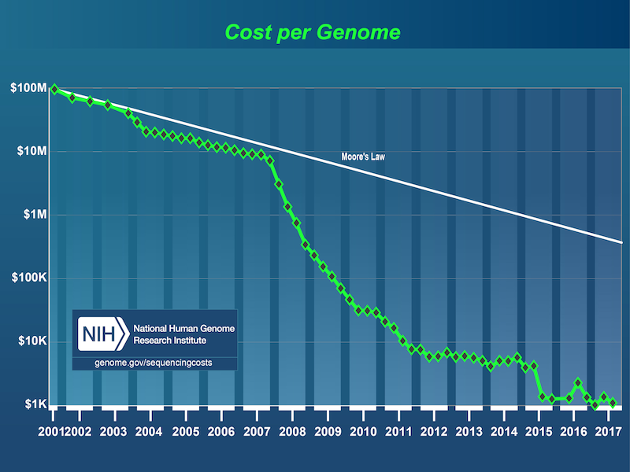

# Genomic Sequencing Analysis Parallelization

Team Members: Andrew Lund, Divyam Misra, Nripsuta Saxena, Kar-Tong Tan

## Project Website
**This README is our project website and serves as the final report for
the work we did throughout the semester.**

- Samtools source code is found [here](https://github.com/samtools)
- Evaluation data, modified source code, batch scripts, and visualization
notebooks are found in this repository

---

### Description of problem and the need for HPC and/or Big Data

[Genomic sequencing](https://en.wikipedia.org/wiki/DNA_sequencing) has many uses
in today's world. Some are as follows:
- Quicker diagnosis of mysterious diseases
- Finding patients with the same disease
- Very important for extremely rare disorders
- Testing for hereditary disorders
- In utero and carrier testing
- Predictive (presymptomatic) testing
- Faster pharmacogenetic testing
- Testing how someone will respond to a certain medication
- Used for certain kinds of cancers

The cost of genomic sequencing as dramatically decreased in the last decade as
evidenced in the following plot from the [National Human Genome Research Institute](https://www.genome.gov/).

As seen above, around 2008 the cost of sequencing has significantly decreased.
Sequencing the first genome is thought to have cost more than $2.7 billion and
took almost 15 years. Today, it can be as low at $1,000 and take as little as
one week.

The primary overhead for genomic sequencing is now computation. The
algorithms used are not easily parallelized, and do not scale linearly.

It is important for sequencing results to be returned in a timely manner
to clinicians and researchers for clinical applications. Greater than one
week runtimes in some applications is too slow for timely diagnostics.

One of the principal application of genomic analysis is identifying single
nucleotide polymorphisms (SNP).

[SNPs](https://en.wikipedia.org/wiki/Single-nucleotide_polymorphism) are
differences in single nucleotides that occur at a specific position in
the genome. The below image illustrates SNPs between three individuals.

We describe our project as both HTC (high-throughput computing) and Big Data.
- HTC: in that there are almost a billion of high-frequency sequence reads for a
person's genome with today's techniques.
- Big Data: in that the genomic alignment files can exceed 200GB.

To that end, the principle goal of our project is:

**To speed up the identification of single nucleotide polymorphisms (SNP) in DNA
and RNA through big data and high throughput computing parallelization
 techniques.**

---

### Description of solution and comparison with existing work

Our project evaluated four primary speedup techniques for speeding up SNP
analysis:
1. Binning - distributing DNA & RNA reads (sequence
strings) into “bins” amongst cores
2. OpenMP - shared-memory technique to reduce execution time
3. MPI - distributed-memory technique to reduce execution timely
4. Load balancing - reduce heterogeneity by sorting genome alignment index files

Each of these techniques and their results are described in detail in the
following sections.

A source we used for our initial profiling analysis is Weeks and Luecke's 2017
paper, ["Performance Analysis and Optimization of SAMtools Sorting"](papers/samtoolsPaper.pdf). They used OpenMP to try and optimize
alignment file sorting.

---

### Model and Data

**Model**:

The SNP analysis software we use throughout the project is
 [SAMtools](http://www.htslib.org/). It is an open-source suite of programs
 for interacting with high-throughput sequencing data, and can be downloaded at
 the link above.

 There are three separate reposititories that make up SAMtools and are required
 for SNP analysis:
 - [Samtools](https://github.com/samtools/samtools) - used for reading, writing, editing, indexing, and viewing SAM/BAM/CRAM alignment files
 - [BCFtools](https://github.com/samtools/bcftools) - used for reading, writing, BCF2/VCF/gVCF files and calling, filtering, summarising SNP and short indel
 (insertion plus deletion) sequence variants
 - [HTSlib](https://github.com/samtools/htslib) - a C library used for reading and writing high-throughput sequencing data

 **Data:**
- Two individuals' DNA and RNA alignment and index files. These are public genomes from 
the [1000 Genomes Project](http://www.internationalgenome.org/).
- Each alignment file (.bam) is about 10GB, and each index file (.bai) is about 5MB.

---

### Technical description of the parallel application and programming models used

---

### Technical description of the software design, code baseline, dependencies, how to use the code, and system and environment needed to reproduce your tests

---

### Technical description of the platform and infrastructure used

---

### Performance evaluation (speed-up, throughput, weak and strong scaling) and discussion about overheads and optimizations done

---

### Description of advanced features like models/platforms not explained in class, advanced functions of modules, techniques to mitigate overheads, challenging parallelization or implementation aspects...

---

### Discussion about goals achieved, improvements suggested, lessons learnt, future work, interesting insights…

---

### references

---
