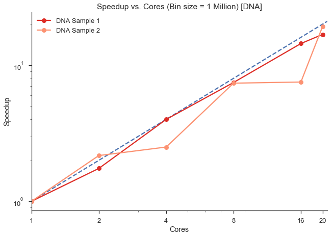
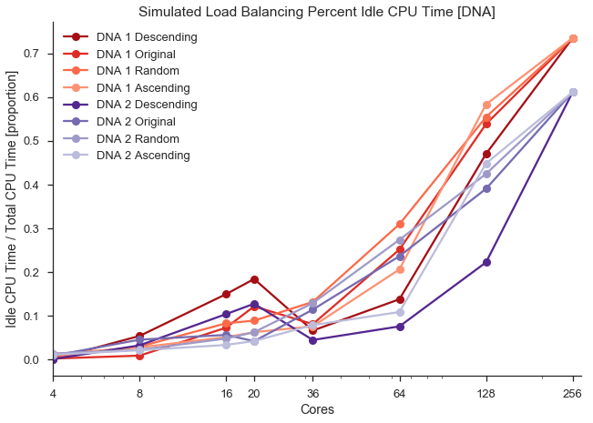
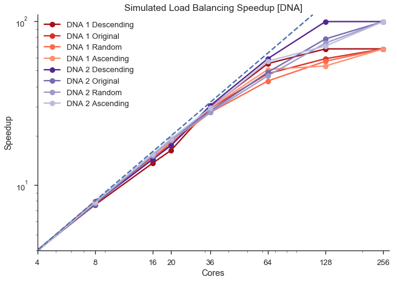
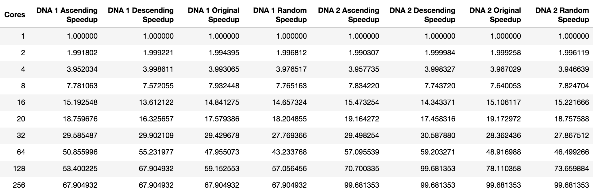
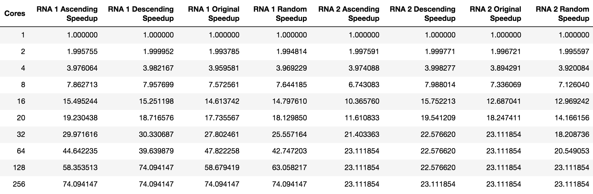

### Harvard University - CS205 Computing Foundations for Computational Science - Spring 2018 - Final Project

# Genomic Sequencing Analysis Parallelization

Team Members: Andrew Lund, Divyam Misra, Nripsuta Saxena, Kar-Tong Tan

---
### Introduction

**What is genomic sequencing?**

[Genomic sequencing](https://en.wikipedia.org/wiki/DNA_sequencing) is the process
of determining the order of nucleotides in an individual. A human genome has
3 billion nucleotides in the form of four letters (A, C, G, and T).

One of the principal applications of genomic sequencing analysis is identifying single
nucleotide polymorphisms (SNP).

[SNPs](https://en.wikipedia.org/wiki/Single-nucleotide_polymorphism) are
differences in single nucleotides that occur at a specific position in
the genome. The below image illustrates SNPs between three individuals.


**What are the uses of genomic sequencing?**

Genomic sequencing has many applications in today's world. Some of them are as follows:
- Very important for extremely rare disorders
- Quicker diagnosis of mysterious diseases
- Finding other patients with the same disease
- Testing for hereditary disorders
- In utero and carrier testing
- Predictive (presymptomatic) testing
- Faster pharmacogenetic (drug-gene) testing (i.e. testing how someone will respond to a certain medication)
- Used for certain kinds of cancers

**Explosion of cheap data outweighs compute infrastructure**

Today, genomic data is being generated at a much faster and efficient rate than the
compute infrastructure that supports its analysis can keep up with. As evidenced in the following
plot from the [National Human Genome Research Institute](https://www.genome.gov/), the cost of genomic sequencing as dramatically decreased in the last decade.

As seen below, the cost of genomic sequencing has significantly decreased since the year 2008.
Sequencing the first genome is thought to have cost more than $2.7 billion by some estimates, and
took almost 15 years. Today, it can be done for as low as $1,000 and takes as little as
one week!

The primary overhead for genomic sequencing is now computation. The
algorithms used are not easily parallelized, and do not scale linearly.


---

### Need for parallelization in computational analysis of genomic data

Given the huge amount of genomic data being produced today and the huge number
of individuals being sequenced. For example, both [GenomeAsia100K](http://www.genomeasia100k.com/) and the UK's [National Health
Service](http://www.sciencemag.org/news/2012/12/uk-unveils-plan-sequence-whole-genomes-100000-patients) are trying to sequence 100,000 individual genomes for
medical and population studies. For a single individual the genomic data is
approximately 100-200 GB. The total size of both these project is in the range
of 1-2 PB and is too large to practically manage on a single machine.

Analysis of a single individual's genome can take up to [~10 days](https://www.intel.com/content/dam/www/public/us/en/documents/white-papers/deploying-gatk-best-practices-paper.pdf) on a single threaded process. To analyze 100,000
such samples, it would take 24,000,000 core hours of computing power, or 2700
years on a single core. This is obviously impractical to run on a single core,
hence the need for parallelization.

In clinical applications, this long analysis is too slow. For example, if we could achieve a 100x speedup from parallelization, we reduce the analysis time from 10
days to 1-2 hours, which in a clinical setting could result in a life saved versus lost.

Given the shear size of the data and computing power required for analysis, we
describe our project as both "Big Data" and "Big Compute."

---

### Need for "efficient" parallelization

Parallelization can result in speedup of analysis, but is often in a non-linear
manner. For example, we may be able to use 10 cores to achieve a 5x speedup. That is why we need to focus on "efficient" parallelization in order to try and achieve a linear speedup and reduce both time and cost. To that end:

1. If the analyses could be completed in-house or on an institutional high-performance computing infrastructure, where the number of nodes is limited and current analysis can take 2-3 months, a more linear speedup of ~20% could result in a time savings of ~2 weeks.

2. If you run analysis on the cloud, these analyses can be quite costly due to
cloud compute pricing. If we used Google Compute cloud infrastructure with a
single core [m1-standard-1](https://cloud.google.com/compute/pricing), running
the 100,000 samples mentioned above, it would cost about $1.14 million. Increasing the
efficiency of the analysis by 10-20% could allow a cost-savings around $100-200K.

The argument for efficient parallelization makes both timely and monetary sense.
To that end, the principle goal of our project is:

**To efficiently speed up SNP analysis through big data and big compute parallelization techniques.**

---

### Model and Data

#### SNP Analysis Model:

The SNP analysis software we used throughout the project is
 [SAMtools](http://www.htslib.org/). It is an open-source suite of programs
 for interacting with high-throughput sequencing data, and can be downloaded at
 the link above. It is a single-threaded program that does not natively support
 parallelization and consists of ~93,000 lines of mostly C code.

 There are three separate repositories that make up SAMtools and are required
 for SNP analysis:
 - [Samtools](https://github.com/samtools/samtools) - used for reading, writing, editing, indexing, and viewing SAM/BAM/CRAM alignment files

 - [BCFtools](https://github.com/samtools/bcftools) - used for reading, writing, BCF2/VCF/gVCF files and calling, filtering, summarizing SNP and short indel
 (insertion plus deletion) sequence variants
 - [HTSlib](https://github.com/samtools/htslib) - a C library used for reading and writing high-throughput sequencing data

Software usage is described below.

#### This Project's Genome Data:
- Two individuals' DNA and RNA alignment and index files - referred to as
"Sample 1", "Sample 2", "DNA1", "DNA2", "RNA1", or "RNA2" throughout this
project.
- Files are public genomes from the
[1000 Genomes Project](http://www.internationalgenome.org/).
- Each alignment file (.bam) is ~10GB, and each index file (.bai) is ~5MB.

Index files are much smaller than alignment files and act like a table of contents to
the alignment file, allowing programs like SAMtools to jump to specific sections
in the alignment file without having to read sequentially through it.

**Alignment & Index Data Downloads:**

DNA1: ftp://ftp.1000genomes.ebi.ac.uk/vol1/ftp/phase3/data/HG00096/exome_alignment/HG00096.mapped.ILLUMINA.bwa.GBR.exome.20120522.bam

ftp://ftp.1000genomes.ebi.ac.uk/vol1/ftp/phase3/data/HG00096/exome_alignment/HG00096.mapped.ILLUMINA.bwa.GBR.exome.20120522.bam.bai

DNA2: ftp://ftp.1000genomes.ebi.ac.uk/vol1/ftp/phase3/data/HG00117/exome_alignment/HG00117.mapped.ILLUMINA.bwa.GBR.exome.20120522.bam

ftp://ftp.1000genomes.ebi.ac.uk/vol1/ftp/phase3/data/HG00117/exome_alignment/HG00117.mapped.ILLUMINA.bwa.GBR.exome.20120522.bam.bai

RNA1: https://www.ebi.ac.uk/arrayexpress/files/E-GEUV-1/HG00096.1.M_111124_6.bam

RNA2: https://www.ebi.ac.uk/arrayexpress/files/E-GEUV-1/HG00117.1.M_111124_2.bam

Index files can be generated using ```$ samtools index sample.bam```

Details about the infrastructure we used are in the "Infrastructure" section
toward the bottom of this report.

---

#### Data Heterogeneity
A key attribute of the data, and all genomic alignment files is that it is
extremely heterogeneous. Each chunk of data can have orders of magnitude different
number of reads (genome sequence strings). This makes sequentially processing
the alignment files very uneven. This unpredictable sizing is illustrated well for
both DNA and RNA of Sample 1 below:

|  Index File Distribution  | Heterogeneity |
|:---:|:---:|
|  |  |
|  |  |

---

### Installing, Running, & Profiling SAMtools

#### Installing the SAMtools analysis suite
SAMtools is already available on the HMSRC cluster. In order to download,
install, and run  a  local version for us to modify on the HMSRC login node, we
performed the following steps:

```Bash
# clone repositories, and install programs
# HTSlib
$ git clone https://github.com/samtools/htslib.git
$ cd htslib
$ autoheader
$ autoconf
$ ./configure
$ make
$ make install

# SAMtools
$ git clone https://github.com/samtools/samtools.git
$ cd samtools
$ autoheader
$ autoconf
$ ./configure
$ make
$ make install

# BCFtools
$ git clone https://github.com/samtools/bcftools.git
$ cd bcftools
$ autoheader
$ autoconf
$ ./configure
$ make
$ make install
```

All program suit makefiles use the ```-O2``` optimization flag by default.
We did not update this flag throughout the project.

#### SAMtools & BCFtools Dataflow

The flow of data from alignment and index files is illustrated below.


SAMtools reads the index and alignment files, pipes standard output to BCFtools,
which identifies SNPs in a data pipeline based on a SNP statistical
model.

#### Running SAMtools on a sample alignment file
To run the overall SNP calling process including ```mpileup``` and
```bcftools``` as the original single-threaded program, use the following command:

```bash
$ ./samtools mpileup -Bcf [reference genome] [sample] | bcftools call -O b -c -w > output.bcf
```

The SAMtools ```mpileup``` function converts the binary alignment file (.bam) into the
`pileup` format. From source code documentation, [mpileup](http://www.htslib.org/doc/samtools.html) "Generate[s] VCF, BCF or pileup for one or multiple BAM files. Alignment records are grouped by sample (SM) identifiers in @RG header lines. If sample identifiers are absent, each input file is regarded as one sample."

In order to run ```mpileup``` to generate the ```pileup``` format follow these steps:

```Bash
# navigate to the local SAMtools installation
$ cd .../samtools
$ ./samtools mpileup
$ ./samtools mpileup .../HG00096.mapped.ILLUMINA.bwa.GBR.exome.20120522.10mil.bam
```
The `pileup` format output is then fed into the BCFtools which
applies a statistical model to decide if a particular location in the genome
has a SNP.

We have provided a small sample of the original data - Sample 1 DNA alignment and index files for 10 million reads. It can be found in this
repository's ```data/sample_data``` directory. We used these specific files extensively
for initial testing due to it's reasonable serial ```mpileup``` runtimes (~30 seconds).
Most of our tests then expanded to one chromosome of each sample.

#### Profiling
Since the SNP analysis is run in a pipe as outlined above, we completed profiling on both SAMtools and BCFtools separately. Both results are shown outlined below.

#### Profiling SAMtools

Profling was completed using the [gprof](https://sourceware.org/binutils/docs/gprof/)
profiler. In order to get the profiler to run, we had to include both the
```-pg``` flag in both the ```CFLAGS``` and ```LDFLAGS``` line items in the
SAMtools ```Makefile```.


To run the gprof profiler on SAMtools use the following commands:
```bash
$ autoheader
$ autoconf -Wno-syntax
$ LDFLAGS='-lprofiler -pg' CFLAGS='-lprofiler -pg' ./configure
$ ./samtools mpileup [sample] > /dev/null
$ gprof ./samtools ./gmon.out
```

Below is a sample of our SAMtools profiler results. The
full profiler text can be found in the ```profiling``` directory.

```bash
Flat profile:

Each sample counts as 0.01 seconds.
  %   cumulative   self              self     total           
 time   seconds   seconds    calls   s/call   s/call  name    
 51.10      1.16     1.16        1     1.16     2.27  mpileup
 18.06      1.57     0.41  4519010     0.00     0.00  bam_plp_next
 12.11      1.85     0.28 26195998     0.00     0.00  pileup_seq
  9.69      2.07     0.22 26896170     0.00     0.00  resolve_cigar2
  5.73      2.20     0.13  4213250     0.00     0.00  bam_mplp_auto
  0.44      2.21     0.01   353719     0.00     0.00  kh_get_olap_hash

index % time    self  children    called     name
                0.00    2.27       1/1           main [3]
[1]    100.0    0.00    2.27       1         bam_mpileup [1]
                1.16    1.11       1/1           mpileup [2]
                0.00    0.00       1/1           sam_global_args_init [114]
-----------------------------------------------
                1.16    1.11       1/1           bam_mpileup [1]
[2]    100.0    1.16    1.11       1         mpileup [2]
                0.13    0.69 4213250/4213250     bam_mplp_auto [4]
                0.28    0.01 26195998/26195998     pileup_seq [7]
                0.01    0.00 4213249/4213249     mplp_get_ref [20]
                0.00    0.00       1/1           bam_mplp_destroy [21]
                0.00    0.00       1/1           bam_smpl_init [76]
                0.00    0.00       1/1           hts_open_format [106]
                0.00    0.00       1/1           hts_set_opt [107]
                0.00    0.00       1/1           sam_hdr_read [115]
                0.00    0.00       1/1           bam_smpl_add [74]
                0.00    0.00       1/1           bcf_call_add_rg [77]
                0.00    0.00       1/1           bam_mplp_init [69]
                0.00    0.00       1/1           bam_mplp_init_overlaps [70]
                0.00    0.00       1/1           bcf_init [83]
                0.00    0.00       1/1           bam_mplp_set_maxcnt [71]
                0.00    0.00       1/1           bcf_destroy [80]
                0.00    0.00       1/1           bam_smpl_destroy [75]
                0.00    0.00       1/1           bcf_call_del_rghash [78]
                0.00    0.00       1/1           bam_hdr_destroy [65]
                0.00    0.00       1/1           hts_close [103]
-----------------------------------------------
                                                 <spontaneous>
[3]    100.0    0.00    2.27                 main [3]
                0.00    2.27       1/1           bam_mpileup [1]
-----------------------------------------------
                0.13    0.69 4213250/4213250     mpileup [2]
[4]     36.1    0.13    0.69 4213250         bam_mplp_auto [4]
                0.00    0.69 4213250/4213250     bam_plp_auto [5]
-----------------------------------------------
                0.00    0.69 4213250/4213250     bam_mplp_auto [4]
[5]     30.4    0.00    0.69 4213250         bam_plp_auto [5]
                0.41    0.24 4519010/4519010     bam_plp_next [6]
                0.00    0.02  305760/305760      bam_plp_push [9]
                0.01    0.01  305760/305760      mplp_func [10]
-----------------------------------------------
                0.41    0.24 4519010/4519010     bam_plp_auto [5]
[6]     28.6    0.41    0.24 4519010         bam_plp_next [6]
                0.22    0.00 26896170/26896170     resolve_cigar2 [8]
                0.01    0.00  305759/305760      mp_free [15]
                0.00    0.01  305759/305759      overlap_remove [19]
-----------------------------------------------
                0.28    0.01 26195998/26195998     mpileup [2]
[7]     12.6    0.28    0.01 26195998         pileup_seq [7]
                0.01    0.00    2670/2670        printw [18]
-----------------------------------------------
                0.22    0.00 26896170/26896170     bam_plp_next [6]
[8]      9.7    0.22    0.00 26896170         resolve_cigar2 [8]
-----------------------------------------------
```
As seen in the above SAMtools profiling statistics, the primary time overheads
occur in:
1. mpileup
2. bam_mpileup
3. pileup_seq

These three specific functions are the focus of our OpenMP parallelization attempt
outlined below.

#### Profiling BCFtools
To run ```gprof``` on BCFtools, we used the following commands inside the
local BCFtools directory:

```bash
$ autoheader
$ autoconf -Wno-syntax
$ LDFLAGS='-lprofiler -pg' CFLAGS='-lprofiler -pg' ./configure
$ CPUPROFILE=./prof.out cat ./DNA.10mil_for_bcftools.file | ./bcftools call -O b -c -v > test.bcf
$ gprof ./bcftools ./gmon.out
```
Below is a sample of our BCFtools profiling. The full output file can be
viewed in the ```profiling``` directory.

```bash
Flat profile:

Each sample counts as 0.01 seconds.
  %   cumulative   self              self     total           
 time   seconds   seconds    calls  ms/call  ms/call  name    
 23.08      0.21     0.21                             bcf_dec_size_safe
 15.38      0.35     0.14                             bcf_fmt_sized_array
 12.09      0.46     0.11                             bcf_fmt_array
  8.79      0.54     0.08        1    80.00    90.00  main_vcfcall
  7.69      0.61     0.07                             bgzf_read
  6.59      0.67     0.06                             _reader_next_line
  5.49      0.72     0.05                             bcf_dec_typed_int1_safe
  5.49      0.77     0.05                             bcf_sr_sort_next
  5.49      0.82     0.05                             kputc
  4.40      0.86     0.04                             bcf_clear
  2.20      0.88     0.02                             bcf_sr_next_line
  1.10      0.89     0.01    20067     0.00     0.00  mc_cal_afs
  1.10      0.90     0.01                             bcf_read
  1.10      0.91     0.01                             bcf_unpack

granularity: each sample hit covers 2 byte(s) for 1.10% of 0.91 seconds

index % time    self  children    called     name
                                                 <spontaneous>
[1]     23.1    0.21    0.00                 bcf_dec_size_safe [1]
-----------------------------------------------
                                                 <spontaneous>
[2]     15.4    0.14    0.00                 bcf_fmt_sized_array [2]
-----------------------------------------------
                                                 <spontaneous>
[3]     12.1    0.11    0.00                 bcf_fmt_array [3]
-----------------------------------------------
                0.08    0.01       1/1           main [5]
[4]      9.9    0.08    0.01       1         main_vcfcall [4]
                0.00    0.01   20067/20067       ccall [14]
                0.00    0.00   20067/20067       set_ploidy [32]
                0.00    0.00       1/1           ploidy_init_string [78]
                0.00    0.00       1/1           init_data [65]
                0.00    0.00       1/1           destroy_data [63]
-----------------------------------------------
                                                 <spontaneous>
[5]      9.9    0.00    0.09                 main [5]
                0.08    0.01       1/1           main_vcfcall [4]
-----------------------------------------------
                                                 <spontaneous>
[6]      7.7    0.07    0.00                 bgzf_read [6]
-----------------------------------------------

```
#### Relative Timing of SAMtools & bcftools
We also compared timings of SAMtools and BCFtools to see which one typically
takes longest to complete execution. Timing results can be found in the
```profiling``` directory.

Here is a sample of those timings on the same sample:

SAMtools ```mpileup``` function
```bash
[kt184@login03 DNA]$ time samtools mpileup -d 100000000000 -Buf /home/kt184/scratch/data/genome/KT_package/icgc_genome_broadvariant/Homo_sapiens_assembly19.fasta ./HG00096.mapped.ILLUMINA.bwa.GBR.exome.20120522.10mil.bam > /dev/null
[mpileup] 1 samples in 1 input files
(mpileup) Max depth is above 1M. Potential memory hog!
Terminated

real	1m19.174s
user	0m20.835s
sys	0m0.976s
```
BCFtools ```bcftools``` function
```bash
[kt184@login03 DNA]$ time cat DNA.10mil_for_bcftools.file | bcftools call -O b -c -v > test.bcf
Note: none of --samples-file, --ploidy or --ploidy-file given, assuming all sites are diploid

real	0m9.302s
user	0m1.235s
sys	0m0.890s
```
Overall, it can be seen that ```mpileup``` execution time is considerably longer than ```bcftools```.

#### Profiling Summary

Based on the above profiling and timing analysis - ```mpileup``` can be up to ten-times
slower than ```bcftools``` - the area of parallelization our
project focused on is the ```mpileup``` function. By improving the execution time
of ```mpileup``` our speedup techniques have the potential to have a greater impact on the
overall efficiency of the entire SNP analysis.

---

### Description of speedup solutions and comparison with existing work

#### Literature
A literature source we used for our initial profiling analysis is Weeks and Luecke's 2017
paper, ["Performance Analysis and Optimization of SAMtools Sorting"](papers/samtoolsPaper.pdf).
They used OpenMP to try and optimize the SAMtools ```sort``` program, which
attempts to arrange alignment files in a predefined and ordered format. We were inspired
by their work, and attempted to apply similar techniques to the ```mpileup```
program in SAMtools.

#### Our speedup strategy
Our project evaluated four primary parallelization techniques for speeding up SNP
analysis. We start each analysis by sharding the large datasets into smaller data chunks, thereby allowing for parallel analysis. We call this distributing of DNA & RNA reads (sequence strings) “binning.” We devised each of these techniques with consideration
of the data heterogeneity and profiling analysis as described in previous sections. We generalize their descriptions as follows:
1. Single-node Parallelization - shared-memory technique to distribute bins amongst
cores in a single node.
2. MPI - distributed-memory technique to reduce execution time across multiple
processes spanning multiple nodes. This technique would spread analysis across independent processes, and combine
their results into a overall SNP file. This allows us to use more than 20 cores
on a single HMSRC cluster node as outlined in the Infrastructure section.
3. Load balancing - reduce analysis heterogeneity by arranging heterogeneous bin
sizes in a way that minimizes CPU idle time during the parallelization process. We developed a load balancing simulator described in detail below.
4. OpenMP - shared-memory technique to reduce execution time. This parallelization
technique has potential to speed up analysis time on single nodes with multiple
cores.

Each of these techniques and their results are described in detail in the
following sections.

---

### Speedup Techniques

**1. Binning** - The standard ```mpileup``` runs as a single-threaded process.
As such our first method of speeding up the SNP analysis involved what
we termed "binning" or distributing the DNA and RNA reads (sequence strings)
into bins amongst cores of a CPU. We distributed them into sequential chunks
from 10,000 to 1,000,000,000. This was done initially with one chromosome on one core
to determine the ideal bin size. After determining the ideal bin size, we tested
that bin size across a number of cores from 2 to 20. We were limited to 20 cores
on a single node on the HMSRC cluster as outlined in the "Infrastructure" section.

A sample batch script for binning is outlined in the "Running ```mpileup``` batch jobs section above.

Results are discussed in the "Results" section below.

##### Running ```mpileup``` batch binning jobs:
In order to automate parallelization speedup analysis of multiple samples with different
parameters, we used the [Perl](https://www.perl.org/) library [Parallel::ForkManager](http://search.cpan.org/~dlux/Parallel-ForkManager-0.7.5/ForkManager.pm) and batch scripts on the HMSRC cluster. The Perl script does both the
automated binning and batch parallel runs of the different bin sizes.

We first wrote a Perl script ```runParallelJobScript.pl``` to automatically generate the bins needed for the parallelization.
At the same time the script runs each of the bins as a parallel process. Once all the subjobs are done,
the Perl script would then combine all the results into one.

As there were multiple different parameters that needed to be tested and also
because the cluster mainly supports the submission of jobs through the use of a
jobscript, we generated a custom Perl script (./batch_scripts/rna.sample1.pl) to also generate the tens of jobscripts
we needed while varying the different paramters (e.g. file used, number of cores etc.).

Sample job submission script files are found in the ```binning_tests``` directory.

**2. MPI** - We used MPI to extend the number of cores that we could utlize for
binning from the single-node limited 20 to a theoretical maximum of 640. We only
went up to 128, but future research will include further expansion and analysis.

We performed the MPI analysis on the Harvard Medical School cluster. As the cluster is
a shared compute cluster used by thousand of users, we do not have root access to
install the packages into the default system file paths for MPI. As such, we built
a custom environment based on Anaconda.

The anaconda package that was pre-installed on the cluster was loaded using the following
command:

```Bash
$ module load conda2/4.2.13
```

We then installed pip, a custom python package manager as follows:

```Bash
$ conda install pip
```

A custom python environment and the mpi4py library was then installed using
the following command:

```
$ pip install virtualenv
$ virtualenv cs205
$ source cs205 activate
$ pip install mpi4py
```

As we had compatibility issues using the openmpi package provided
on the cluster with the mpi4py package that we had installed. We
manually installed openmpi-3.0.1 into a custom local path via the
following command after downloading the package into a local directory.

```Bash
$ ./configure --prefix=$PWD/cs205_mpi/
$ make
$ make install
```

The version of mpi in the current conda environment was then utilized
for running mpi rather than the default openmpi installed on the
cluster.

```Bash
$ /home/kt184/.conda/envs/cs205/bin/mpirun
```

Having set up openmpi with mpi4py in our environment, we then wrote a
job script and submitted it onto the cluster for the run. The
MPI job was sent to an 'MPI' queue that was set up on the cluster
and for which we had to request special permission to use.

A sample jobscript for running the mpi python script we wrote
for the project is as follows:

```Bash
#!/bin/bash
#SBATCH -p mpi #partition
#SBATCH -t 0-24:01 #time days-hr:min
#SBATCH -n 3 #number of tasks
#SBATCH --mem=8G #memory per job (all cores), GB
#SBATCH -o %j.out #out file
#SBATCH -e %j.err #error file

source activate cs205

extension=/home/kt184/cs205/mpi_examples/mpi4py-examples/results/DNA1.core2
/home/kt184/.conda/envs/cs205/bin/mpirun -n 3 python ./runMPIpileup.py 1000000 /n/scratch2/kt184/data/DNA/HG00096.mapped.ILLUMINA.bwa.GBR.exome.20120522.bam /home/kt184/scratch/data/genome/KT_package/icgc_genome_broadvariant/Homo_sapiens_assembly19.fasta 3 $extension 1 249250621

```

In the above jobscript, we requested 3 tasks to represent a single master process and 2 worker processes. The master process would decide upon the job needed to be performed by each worker process, collect back the results of analysis by the worker processes and compile the results.

The sample python script we used for mpi4py can be found in the ```mpi_tests/code``` directory.

The `runMPIpileup.py` python script starts a master process and allow us to vary the number of worker processes utilized for MPI. Results are compiled
by the master process after all the workers have finished their jobs. We then tested how the speedup for the DNA and RNA files varies as the number of cores (processes) utilized for MPI varies.

**3. Load Balancing** - Given the heterogeneity of the data as described above,
we expect parallelization techniques like binning and MPI to result in an increase
in idle CPU time as the number of parallel processes increase. By sorting, or "load
balancing" the data as it is distributed amongst parallel processes, we hope to reduce
the proportion of CPU idle time and wasted processing power.

Every genome alignment (.bam) file has an accompanying index (.bai) file. This index file does not contain any sequence data; it essentially acts like a table of contents for the alignment file. It is typically used to directly jump to specific parts of the alignment file without needing to read the entire fie sequentially, which can be incredibly efficient since an alignment file is typically quite large (for example, our alignment files are ~10GB).

Thus, in principle, by studying the structure of the index file, we should be able
to smartly and quickly identify the distribution of the heterogeneous data, sort it by chunk size size (smartly binning), distribute the work evenly among processes,
and reduce the overall analysis time as compared to the current sequential analysis methodology.

To this end, our original plan was to read the binary index file by converting it into text format, so that we could analyze it as described above to try and determine the optimal way to sort the data during the analysis computation.

An alignment (.bam) file can be easily converted from binary to human-readable text format (.sam, which stands for Sequence Alignment Map), as viewing the sequence in a human-readable form has many uses. However, since index files are mostly used only to be able to jump to the relevant sections of the alignment file, converting an index file into a human-readable text format is not a straightforward task. We realized just how difficult a task this was once we started working on this project. We consistently ran into roadblocks while trying to read the index file. Multiple approaches were implemented; unfortunately none of them worked out.

Our first approach was to understand where the SAMtools code was reading the index file. We tried to append the code so that it would read the index file and try to convert it to a text format. That did not work. We also tried to use an open-source library for SAMtools written in Java, "htsjdk," so that we could read the metadata from the index files. That did not work either. Lack of domain knowledge about genomic sequencing data hindered us from writing our own code to convert the index file. Here is a sample of one of the
attempts to parse the index file into human-readable text:

```Bash
public class ReadIndexCustom {

    public static void main(String[] args) throws IOException {
        QueryInterval queryInterval = new QueryInterval(1,1,10000000);
        File file = new File(args[0]);
        BAMFileReader br = new BAMFileReader(null, file, false, false, null, null, null);
        BAMIndex index = br.getIndex();
        final BAMFileSpan fileSpan = index.getSpanOverlapping(queryInterval.referenceIndex, queryInterval.start, queryInterval.end);
        System.out.println(fileSpan);

    }

}
```
After these failed attempts to read the index file, we decided to implement a load balancing simulator.

#### Load Balancing Simulator
In order to process the heterogeneous data we developed a load balancing simulator. The simulator
(```simulateLoadBalance.py```), batch script, sample input,
and output timing files are found in the ```load_balance_simulator``` directory.

The load balancing simulator was written in Python with a 'Manager' and 'Worker' object classes. The 'Manager' class controls the overall simulation, keep tracks of the number of tasks that needs to be done, the global simulation time, the number of workers available, and performs the allocation of the tasks towards each worker. The 'Worker' class simulates each parallel process and is given a task with a defined amount of work to do which can be performed in a preset duration of time.

Using the simulator we can simulate the parallelization process in which each task is passed on to each parallel process. Given the runtimes of each task which we had already collected from our previous parallel runs and tests, we used these to simulate the whole parallelization process and determined (1) the overall runtime and (2) the idle CPU time of each worker process and (3) the overall amount of wasted computational power, when different number of CPU cores and load balancing strategies are utilized.

We can then apply different load balancing strategies to assess how these different benchmarks change with different load balancing strategies. Specifically, we simulated four different load balancing
techniques to parallelize the data across a range of cores:

1. Ascending data size processing
2. Original data order processing
3. Random order processing
4. Descending data size processing

Briefly, in the 'ascending data size processing' load balancing strategy, the smallest tasks that required the shortest processing time were processed first and the largest tasks that required the longest processing time were processed last. In the 'descending data size processing' strategy, the biggest sized data was processed first and the smallest sized data was processed last during the parallelization. The 'Original data order processing' load balancing strategy processes the data in their original order, regardless of the size and time needed to process these data chunks. The 'Random order processing' strategy randomizes the processing of these data chunks. Specifically, three randomizations were performed and the average of each benchmark across the three randomizations computed.

Results for these four sorting techniques are discussed in the "Results" section
below.

**Running Load Balancing Simulations**

To run the simulator, use a command similar to the following:
```Bash
$ pypy simulateLoadBalance.py input_sample.txt > output.simulate.txt
```


**4. OpenMP** - Based on the profiling outlined above, we focused our OpenMP
parallelization on the mpileup, bam_mpileup, pileup_seq functions. All three of
these functions are found in the SAMtools library, specifically in the
```bam_plcmd.c``` file.

It is important to note that when recompiling the SAMtools library, one must
include the ```-fopenmp``` flag on both the ```CFLAGS``` and ```LDFLAGS```
lines within the ```Makefile```. It is also important to add
```#include omp.h``` in the module header.

We moved sequentially through the functions, adding
```#pragma``` lines on for loops, recompiling and making using
```$ make clean``` and ```$ make all``` commands, and running SAMtools on the
HG00096.mapped.ILLUMINA.bwa.GBR.exome.20120522.10mil.bam sample found in the
```data/sample_data``` directory.

To run a timed OpenMP test on our small chromosome sample we used the following
generic command:

```Bash
$ time ./samtools mpileup sample.bam > dev/null
```
The number of OpenMP threads was adjusted using the ```$ export OMP_NUM_THREADS="n"```
command.

Results for our OpenMP tests are found in the
"Results" section below.

---

### Results
Results for each of the previously described speedup techniques are analyzed and
critiqued below:

**1. Binning**

We tried to shard the data into "small" bins in order to allow parallel execution
amongst cores. Thus, having more bins allows more parallelization and a greater
speedup. However, it can be foreseen that if there are too many bins, there will be larger overheads due to splitting the data, core execution and communication, leading to a potential increase in overall runtime. There is thus a need to find the optimal bin size
in which the overall runtime can be reduced by parallelization while minimizing the overheads from having too many bins.

There are two principal steps to our binning parallelization technique.
1. Determine the minimum bin size for sequence reads
2. Spread bins of ideal size across cores from 2-20 and analyze runtime and speedup

As seen below, we determined that at least 1,000,000 reads per bin is the optimal
number. For both DNA and RNA, the one chromosome analysis runtime decreases
from 10,000 to 100,000 then levels off. We also decided to use
1,000,000 as the optimal size as increasing the bin size further will reduce the
total number of bins for a sample which reduces the benefit of parallelization.

With a bin size of 1 million, we would like to note that one chromosome will be
limited to ~250 bins, thus allowing us in principle to use up to ~250 parallel
processes for SNP analysis. We used one chromosome from each sample for the majority of our project's analyses.

|  DNA  | RNA |
|:---:|:---:|
|  |  |

As seen in the time and speedup plots and table, we see excellent speedup for our binning
technique and are pleased with the results. All results show a nearly linear speedup
compared to the dashed linear line. It is interesting to note that RNA 1 exceeded linear
speedup, and we think this is perhaps due to the single core (our serial benchmark) being
too fast. This could be mitigated by running more tests and averaging them.

|  DNA  | RNA |
|:---:|:---:|
|  |  |
|  |  |
| |  |


**2. MPI**

Based on the plot below, we can see that in general, as the number of cores increased from 1 to 128, the execution time needed for analysis decreased for both the DNA and RNA samples linearly. Correspondingly, the speedup of the execution as the number of cores increased is also fairly linear, with the RNA sample following closer to the theoretical linear speedup line and with the DNA sample showing slightly more deviation from the theoretical linear speedup. In particular, at 64 cores, we see that the speed up for the DNA sample was only 40.7x which is lower than the theoretical maximum possible speedup of 64x. The speedup for the RNA sample for the same number of core was however 50.3x. Given the amount of time
dedicated to simply getting MPI to work on the HMSRC cluster, we would have liked to perform multiple
tests to see an average execution time and speedup for each sample, but were limited in time.

A even sharper deviation from linearity is noted at 128 cores, with both the DNA and RNA samples showing only 56.2x and 55.5x speedup relative to the theoretical possible amount of 128x. This is possibly because the data was only split into ~250 bins. Some of the predefined bins may contain no data and thus most of the CPU processes that were allocated to these empty bins were thus just idling and not doing anything. Executing MPI on a larger dataset with more bins would be an excellent extension of these
tests, and we would hope to see similar linear speedup.


|Execution Time|Speedup|
|:--:|:--:|
||
||

**3. Load Balancing**

Our load balancing simulation results are shown below. As suspected, the ascending order
sorting strategy resulted in the least amount of CPU idle time

- discuss impact of different strategies
- discuss differences between how DNA and RNA behaved.
- dicuss proportion of idle time
- discuss impact on speedup
- discuss heterogeneity between RNA1 and RNA2. Curves look very different.
- emphasize how much improvement we can get from Best vs. Original and Best vs. worst case.


|  DNA  | RNA |
|:---:|:---:|
|  |  |
|  |  |
||


**4. OpenMP**
As previously noted, we focused our OpenMP parallelization on three functions
within the ```bam_plcmd.c``` module of SAMtools. There were no for loops that
were parallizable in the bam_mpileup function. Module files for each OpenMP
attempt are in the ```open_mp_tests``` directory. The results for our
10 million read sample follow:

| Function | 1 thread time (seconds) | 8 threads time (seconds)
|---|---|---|
| no pragmas | 22.3 | --- |  
| mpileup (8 pragmas) | 37.5 | 37.4 |
| pileup_seq (2 pragmas) | 103.7 | 50.5 |

As seen above, all attempts to speed up the ```mpileup``` module using OpenMP
resulted in slower execution times. We suspect this is due to complex
interdependencies between SAMtools and HTSlib that we did not have time to
investigate within the scope of this project.

We were also ultimately unable to properly compile BCFtools with the ```-fopenmp```
flag on the HMSRC cluster, and due to
its relatively slow runtime when compared to SAMtools we did not further attempt
to parallelize BCFtools with OpenMP.

---

### Description of advanced features like models/platforms not explained in class, advanced functions of modules, techniques to mitigate overheads, challenging parallelization or implementation aspects...
- Our primary advanced features we developed is the load balancing simulation.
This module can be used to simulate balancing blah blah blah.

As the SAMtools library was a really big package with many depending C formatted files, requiring prior configuration, generation of a make file and the final compilation of the package, we were unfamiliar with how how to include the profiling packages towards these complex packages. As such, we initially had a very hard timing profiling the SAMtools library and we spent more than two weeks attempting to run the gprof profiler, and finally had a
breakthrough when we learned we needed to include the ```-pg``` flag in both the
CGLAFS and LDFLAGS sections of the associated ```Makefile```. This same technique
was used to compile our OpenMP parallelization attempts.

Here, we also attempted to utilize OpenMP to parallize the mpileup program. However, we note that our attempts to paralleize the program using OpenMP was largely unsuccessful, with the use of pragmas within the program found to lead to no significant improvment in the execution time despite a number of attempts and considerable efforts that we have made. From the analysis of the code, we note that the heavy component of the code was largely in the reading of the input file and in generation of the output which is then written out to standard output. Since it is really difficult to parallelize the writing of the results into standard output, the use of OpenMP is unlikely to work here.

As such, it seems that Samtools mpileup is a program that is not easy to directly parallelize. Indeed, based on a discussion on the github repository of the original package, we note that attempts by others have been made to parallelize the code for the mpileup program. However, others have faced similar difficulties as we have. Specifically, we quote: "We did some profiling, but the algorithm is complex and rather hard to multi-thread in the current state" (https://github.com/samtools/samtools/issues/480). Thus, we regard the difficulty we faced in applying OpenMP and in parallelizing the program as a fundamental intrinsic issue caused by the algorithm utilized by Samtools mpileup.


- Java libraries and htslib libraries were hard to read through. htslib code was not very well
commented and intuitive to understand.

Use of load balancing is an advanced feature in my opinion.


#### Prediction of optimal load balancing strategy using custom simulator

Using the custom simulator we have designed, we can simulate and determine what is the overall runtime and
wasted compute time given different amounts of load, number of processing cores utilized and load balancing strategies. Since it is possible for us to predict the workload at runtime based on the 'index file' reader we had set out to build, we would be able to predict the workload encountered by each bin during the parallelization. Given this information, we can then simulate different load balancing strategies top decide upon an optimal number of processing cores and load balancing strategies which will make the overall run complete more quickly and efficiently.


---

### Discussion about goals achieved, improvements suggested, lessons learnt, future work, interesting insights…

We are very happy with the speedup we achieved through binning and simulated load balancing. After determining
the optimal bin size of 1 million
- Discuss trying to read the index file with JAVA, etc.
- We would have liked to include Spark. ADD COMMENTARY HERE

---

### Infrastructure


Our team used the [Harvard Medical School Research Computing](https://rc.hms.harvard.edu/) (HMSRC) cluster for all testing and analysis.

**HMSRC description:**
- 8,000 cores
  - 32 or 28 cores per node
    - Nodes support up to 32 cores, but are capped at 20
    - A known problem in parallelization of related genomic algorithms
  - 256 GB RAM per node (8-9 GB/core)
- 24 GPUs (8 M40 / 16 K80) - Not utilized for this project
- Login/load balancer 5 VM (8 cores/16 GB memory)
- InfiniBandconnectivity between nodes
- CentOS 7
- SLURM batch system
- Supports OpenMP, MPI
- Currently does not support Spark (we initially intended on using Spark for
  load balancing implementation)

**HMSRC Cluster Architecture:**


---

### References

Throughout this report sources are cited through inline links.
They appear in the following order:
- ADD SOURCES HERE

---

**This README is our project website and serves as its final report.**

- Samtools source code is found [here](https://github.com/samtools).
- Evaluation data, modified source code, simulation and batch scripts, and visualization
notebooks are all found in this repository

# TODO:
- ADD LOAD BALANCING SIMULATOR DESCRIPTION
- idea of using load balancer to predict how to load balance and different load balancing strategies.
- talk about the structure of the index file and what data it contains.
